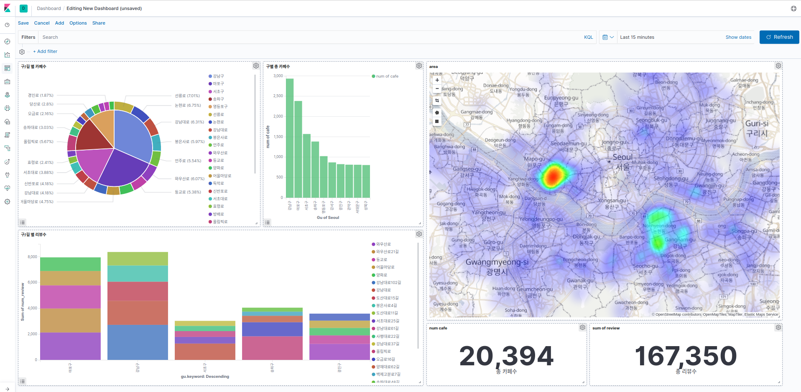

# Analysis for a Coffee Cafe in Seoul(on goging)
- Purpose: help to find respective place to open a cafe in seoul

- Data field: 
	- cafe name, number of review, address 
	- TBD(the distance between the nearest subway station and the cafe)
- Overview Visualization by ELK

- Resource:
	- `addr_complete.pickle`: Seoul addr ()
		- *eg. {'강남구': ['강남대로100길', ..., '강남대로132길', ...], '강동구': [...], ...}*
	- `unique_cafe_addr.pickle`: cafe addr(#: 22836) 
		- *eg. '서울 강남구 강남대로94길 28'*
	- `cafe_info.pickle`: cafe info(#: 20431)
		- *eg. {'addr': '서울 강남구 강남대로94길 28', 'category': '카페', 'name': '카페익스프레스 강남1호점', 'num_review': '0', 'rate': '0.0'}*
	- `cafe_xy_info.pickle`: cafe coordinate(#: 20431)
		- *eg. {'addr': '서울 양천구 남부순환로42길 35', 'x': '37.5332561', 'y': '126.8249225'}*
	- `cafe_sales_gu`: average sales per gu (#: 25)
